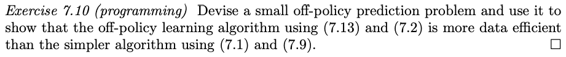

# Dyna-Q with pseudocode

## Exercise 7.10 (programming) 
Devise a small off-policy prediction problem and use it to show that the off-policy learning algorithm using (7.13) and (7.2) is more data efficient than the simpler algorithm using (7.1) and (7.9).

